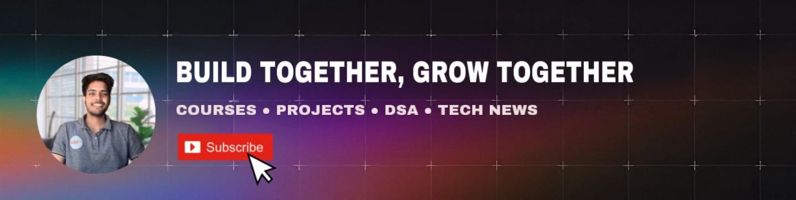

<a href="https://www.youtube.com/@RitikPrasad-lz8fk">
  <picture>
    <source media="(prefers-color-scheme: dark)" srcset="./rp_banner.jpeg" />
    <source media="(prefers-color-scheme: light)" srcset="./rp_banner.jpeg" />
    
  </picture>
</a>


<div align="center">
   
  <h3 align="center">Packed with React Native,Redux Tookit, Trading Chart and many more TPL</h3>
   
</div>


Welcome to the Groww App repository! This React Native application for the Groww Clone project. Below, you'll find instructions on how to set up the development environment and configure necessary variables 

## Installation

Before you begin, make sure you have Node.js and npm installed on your system.You have setup configuration  Setup (PREFER CHAPTER 1) 

1. Clone this repository to your local machine:

```sh
   git clone https://github.com/Ritik5Prasad/GrowwClone_Public.git
```

2. Navigate to the project directory:

```sh
   cd GrowwClone_public
 ```

3. Change the `GOOGLE CLIENT ID` and `APPLE SIGN`:

You can checkout the chapter 4,5,6 for configuration process of this or you can skip it if you dont want to setup


## Running the App

Once you have configured the `THE CLIENT ID` file, you can start the server by running:

```sh
npm install
npm start
```
This will install the necessary dependencies and start the server on the specified port.
Please follow up the Videos on youtube for any confusions


## Contributing

If you'd like to contribute to this project, please fork the repository and create a pull request with your changes. We welcome any contributions, whether it's fixing bugs, adding features, or improving documentation.

## License

This project is licensed under the [MIT License](LICENSE), which means you are free to use, modify, and distribute the code as long as you include the original license in your distribution.

---

Happy coding! If you have any questions or need further assistance, feel free to reach out to us.